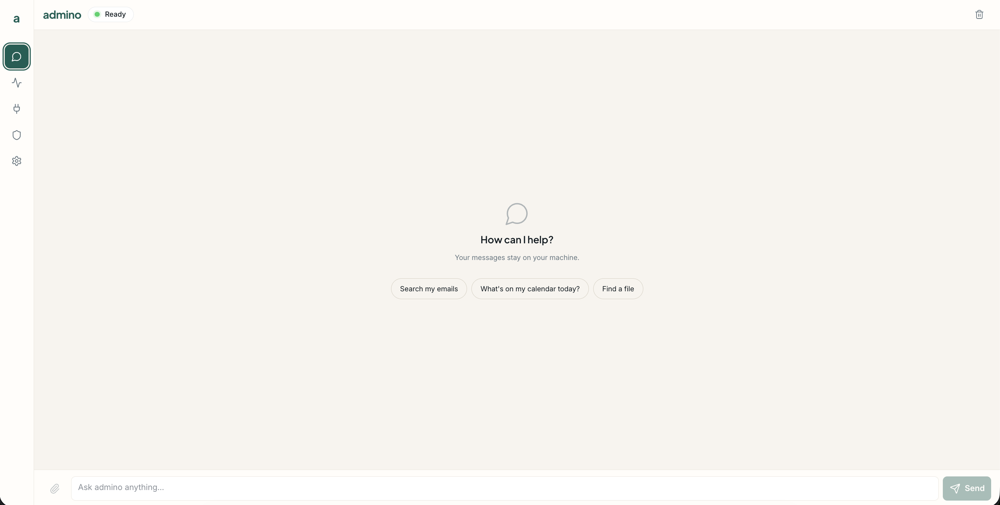
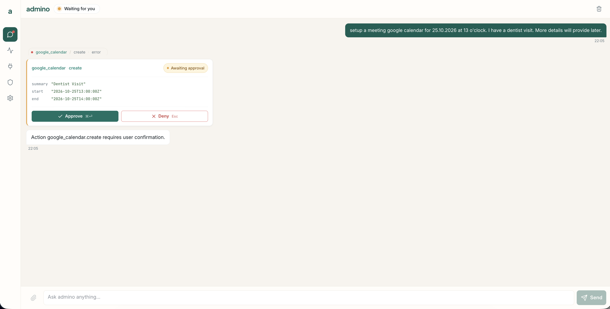

<p align="center">
  
</p>

<p align="center">
  
</p>

<p align="center">
  <b>The AI that works for you, not on you.</b><br>
  <sub>A privacy- and security-first personal AI agent you run yourself.</sub>
</p>

<p align="center">
  <a href="LICENSE"></a>
  
  
  <a href="CONTRIBUTING.md"></a>
</p>

<p align="center">
  <a href="docs/getting-started.md">Getting&nbsp;Started</a> ·
  <a href="docs/permissions.md">Permissions</a> ·
  <a href="docs/SECURITY.md">Security&nbsp;Model</a> ·
  <a href="docs/tools.md">Tools</a> ·
  <a href="docs/configuration.md">Configuration</a> ·
  <a href="CONTRIBUTING.md">Contributing</a>
</p>

---

admino chats with you and can act on your behalf — reading your mail, calendar, and
drive files — but **every action it takes is gated by an isolated permission engine the model
can neither see nor bypass**. Read actions run freely; anything that changes state pauses
for your approval; a handful of destructive actions are denied outright. You run it on
your own machine, your data stays with you, and nothing happens on your accounts without
your say-so.

## ✨ Why admino

- 🔐 **Isolated permission engine** — a pure `(tool, action)` function the LLM never sees, can't argue with, and can't route around. Default-deny; writes are never silently auto-allowed. → [Permissions](docs/permissions.md)
- 🏠 **Runs on your server** — your audit log, memory, and documents stay on the machine that runs admino. Only the active LLM provider sees the conversation.
- 🧯 **Contained blast radius** — the agent container is whitelist-only egress, so even a hijacked agent can't phone home. → [Security Model](docs/SECURITY.md)
- 🔑 **You own your data** — PostgreSQL on your box, OAuth tokens encrypted at rest, and a content-free, append-only audit log of every tool decision.
- 🧩 **Real tools** — Gmail, Google Calendar, Drive, Outlook, OneDrive, and memory — all permission-gated. → [Tools](docs/tools.md)
- 🤖 **Your choice of model** — [Infomaniak AI Services](https://www.infomaniak.com/en/hosting/ai-services) by default (processed in Switzerland; queries aren't recorded or used for training), an opt-in local vLLM CPU container (Apple Silicon + Linux), and Claude or OpenAI as opt-in cloud providers. → [Configuration](docs/configuration.md)

## 📸 Screenshots

| Chat | An action pausing for your approval |
| :---: | :---: |
|  |  |

<p align="center"><sub>A <code>confirm</code> action — <code>google_calendar.create</code> — waiting for approval before it runs.</sub></p>

## 🚀 Quick start

### Requirements

- **Python 3.12+**
- **[uv](https://docs.astral.sh/uv/)** — the package & virtualenv manager (`curl -LsSf https://astral.sh/uv/install.sh | sh`)
- **Docker** + Docker Compose — runs PostgreSQL (and the whole backend, optionally)
- **An Infomaniak AI Services API token** for the default model — create it in the Infomaniak Manager with the `ai-tools` scope and set `INFOMANIAK_API_TOKEN` in `.env`. See [Configuration → Infomaniak](docs/configuration.md#infomaniak-ai-services-default).
- *Optional, local inference:* `make start-local` adds the vLLM CPU container (downloads the model, ~8 GB, on first run). See [Configuration → Local vLLM](docs/configuration.md#local-vllm-cpu-container). Docker Desktop needs ~12–16 GB RAM allocated.
- *Optional, other cloud providers:* an [Anthropic](https://console.anthropic.com/) or [OpenAI](https://platform.openai.com/api-keys) API key. Set it in `.env` and switch the provider in Settings → Agent.
- *Optional:* Google / Microsoft OAuth apps to enable the mail, calendar, and drive tools — see [Getting Started → Connect your accounts](docs/getting-started.md#connect-your-accounts).

### Run locally (with uv)

```bash
# 1. Install dependencies — uv builds an isolated .venv from pyproject + uv.lock
uv sync --extra dev          # all providers + dev tooling
source .venv/bin/activate

# 2. Configure — copy the sample env
cp .env.example .env
#    PG_PASSWORD is prefilled with the dev default: changeme
#    Set INFOMANIAK_API_TOKEN (the default LLM provider)

# 3. Load .env into your shell — `make run` reads the shell environment, not .env
set -a; source .env; set +a

# 4. Start PostgreSQL (Docker), create the first account (prompts for a password), start the agent
make dev-db
python -m admino.admin_cli create-superadmin --email you@example.ch --name 'Your Name'
make run
```

Open **http://localhost:8000** and log in (see
[Create the first Super Admin](docs/getting-started.md#5-create-the-first-super-admin)). With
`INFOMANIAK_API_TOKEN` set you're ready to chat on Qwen3.5 (Infomaniak). Without it,
admino still boots and the chat tells you which variable to set. **Settings → Agent**
switches to local **vLLM**, **Claude** or **OpenAI**.

### Local vLLM serving — CPU container (opt-in, cross-platform)

The optional local model is **Qwen3 4B Instruct** (`Qwen/Qwen3-4B-Instruct-2507`).
It runs as a Docker CPU container — cross-platform on Apple Silicon and Linux, nothing
outside Docker, no Metal, no host process.

```bash
make start-local # downloads the model on first run (~8 GB), then brings up postgres + agent + vllm
make vllm-down   # stop just the vllm container when done
```

Then pick **vLLM** in Settings → Agent.

The agent reaches the vllm container at `http://vllm:8000/v1` over the shared internal
Docker bridge. Until the container is ready, admino boots and replies with a friendly
"model unavailable" message rather than crashing.

**Trade-offs:** CPU inference is slow (a few tokens/sec); a smaller model like
`Qwen/Qwen3-1.7B-Instruct-2507` is snappier. Docker Desktop needs **~12–16 GB RAM**
allocated (Settings → Resources → Memory) — the default 8 GB is not enough for a 4B
FP16 model. FP16 only (no 4-bit quant in the CPU image).

NVIDIA GPU serving is tracked in **[#132](https://github.com/ljakupi/admino/issues/132)**
(swap the CPU image for the CUDA image + add a GPU reservation).

### Run the whole backend in Docker

Starts the agent (behind its egress firewall) and PostgreSQL together — Docker reads
`.env` directly, so no shell export needed:

```bash
cp .env.example .env               # change PG_PASSWORD; set INFOMANIAK_API_TOKEN
make docker-build
make docker-up                     # → http://localhost:8000 (postgres + agent)
# or: make start-local             # adds the opt-in local vllm container
make create-superadmin EMAIL=you@example.ch NAME='Your Name'   # first account
```

On a server, `make start-prod` puts a Caddy TLS reverse proxy in front of the agent for
`ADMINO_DOMAIN` (HTTPS with Let's Encrypt, HSTS). See
[Production deployment](docs/configuration.md#production-deployment-tls-reverse-proxy).

> **New here?** The [Getting Started guide](docs/getting-started.md) walks through
> configuration, connecting Google/Microsoft accounts, and your first chat in detail.

## 📚 Documentation

| Guide | What's inside |
| --- | --- |
| **[Getting Started](docs/getting-started.md)** | Install, configure, run (local & Docker), connect accounts, first chat |
| **[Permissions](docs/permissions.md)** | The permission engine: allow / confirm / deny, hardcoded denials, promotion flow |
| **[Tools](docs/tools.md)** | Every tool and action admino ships with today |
| **[Configuration](docs/configuration.md)** | LLM providers, `config.yaml`, data & storage, accounts and sessions |
| **[Security Model](docs/SECURITY.md)** | Egress containment, the root→non-root privilege drop, threat model |

## 🗺️ Roadmap

- **Local vLLM serving — NVIDIA GPU** (in-container CUDA) — tracked in [#132](https://github.com/ljakupi/admino/issues/132). CPU inference (cross-platform) is available now.
- **Documents** store and **web search** tools.
- End-to-end SSE streaming and a richer health endpoint.

_Planned and **not** in this alpha — don't expect them to work yet._

## 🤝 Contributing

admino is **issue-driven** and **test-first**: every PR maps to an approved issue and must
pass the full quality gate (`make check`, ≥ 90 % coverage). Start with
[CONTRIBUTING.md](CONTRIBUTING.md).

Found a security issue? Please **don't** open a public issue — report it privately, as
described in the [Security Model](docs/SECURITY.md#reporting-a-vulnerability).

## 📄 License

Licensed under the [Apache License 2.0](LICENSE). Contributions are covered by the
[Contributor License Agreement](CLA.md).

<p align="center"><sub>Built with FastAPI · Pydantic · PostgreSQL · Vue 3 — and no agent frameworks.</sub></p>
