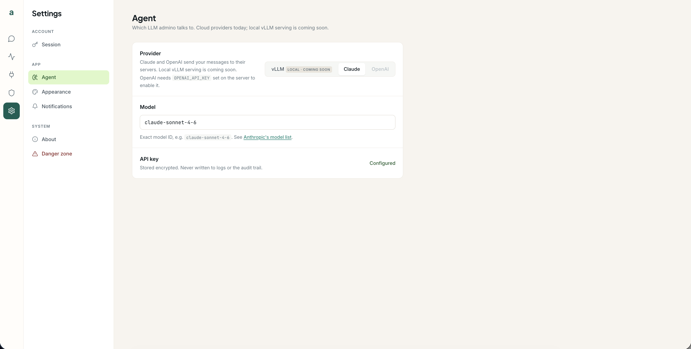

# Configuration

admino is configured by two things:

- **`config/config.yaml`** — non-secret application settings, validated by Pydantic at
  startup. The agent refuses to start on invalid config with a clear error.
- **Environment variables** — **all secrets** (API keys, OAuth client secrets, the
  encryption key, the auth token) and a few runtime overrides. Documented inline in
  [`.env.example`](../.env.example).

> **Secrets are never read from `config.yaml`.** They come from the environment only, and
> are never written to disk in plaintext.

- [LLM providers](#llm-providers)
- [Local vLLM (CPU container)](#local-vllm-cpu-container)
- [`config.yaml` reference](#configyaml-reference)
- [Authentication modes](#authentication-modes)
- [Data & storage](#data--storage)
- [Egress whitelist](#egress-whitelist)

## LLM providers

admino is local-first. **vLLM is the default provider**, served as a Docker CPU container
— cross-platform on Apple Silicon and Linux, no Metal, no host process, nothing outside
Docker. No cloud calls by default.

| Provider | Status | Needs |
| --- | --- | --- |
| **vLLM** | **local · available (CPU container, cross-platform)** (default) | `make vllm-pull` once, then `make start`. See below. |
| **Claude (Anthropic)** | opt-in cloud | `ANTHROPIC_API_KEY` in the environment. |
| **OpenAI** | opt-in cloud | `OPENAI_API_KEY` in the environment. |

Cloud providers send your messages to their servers; everything else — audit log, memory,
documents — stays on your machine. Until the vLLM container is ready, admino boots and
replies with a friendly "model unavailable" message rather than crashing.



<sub>Settings → Agent — switch between vLLM (local) and the cloud opt-ins.</sub>

**Switching providers:**

- In the UI: **Settings → Agent**, pick the provider.
- Or set `LLM_PROVIDER` in the environment (overrides `config.yaml`).
- Model IDs live in `config.yaml` under `llm` (`anthropic_model`, `openai_model`); both
  stay set so switching needs no model edit. The API key still comes from the environment.
- Point the OpenAI provider at any OpenAI-compatible server with `OPENAI_BASE_URL`.

## Local vLLM (CPU container)

admino ships `vllm/vllm-openai-cpu:latest` — a **multi-arch** image (`linux/arm64` +
`linux/amd64`). Docker auto-pulls the right variant on Apple Silicon and x86-64 Linux.
The container exposes an OpenAI-compatible API on port 8000 and is attached to the
`internal` Docker bridge only — **zero external network access** at runtime.

**Default model:** `Qwen/Qwen3-4B-Instruct-2507` — a small, strong tool-caller (~8 GB
FP16). NVIDIA GPU serving is tracked in
[#132](https://github.com/ljakupi/admino/issues/132) (swap the CPU image → CUDA image +
add a GPU reservation).

**Trade-offs to be aware of:**

- CPU inference is slow: expect a few tokens per second. `Qwen/Qwen3-1.7B-Instruct-2507`
  is snappier if throughput matters.
- Docker Desktop must have **~12–16 GB RAM allocated** (Settings → Resources → Memory).
  The default 8 GB is not enough for a 4B FP16 model.
- FP16 only (no 4-bit quant in the CPU image).

### Daily workflow

```bash
make vllm-pull   # one-time: download model weights (~8 GB) into the Docker volume
                 # Set HF_TOKEN in the environment first if the model repo is gated.
make start       # provision + bring up postgres + agent + vllm together
make vllm-down   # stop just the vllm container (agent + postgres keep running)
```

`make start` is the one-command path: it checks for the volume first and skips the
download if the model is already provisioned.

### Override the model or endpoint

| Variable | Default (from `config.yaml`) | Notes |
| --- | --- | --- |
| `VLLM_MODEL` | `Qwen/Qwen3-4B-Instruct-2507` | Any HuggingFace model the CPU image supports. `vllm-pull` and the vllm container both honor this. |
| `VLLM_BASE_URL` | `http://vllm:8000/v1` | The agent reaches the vllm service over the internal Docker bridge. Only change this if you run vllm outside of docker-compose. |
| `VLLM_MAX_MODEL_LEN` | `8192` | Maximum sequence length in tokens. Raise for longer context if you have enough RAM. |
| `VLLM_IMAGE` | `vllm/vllm-openai-cpu:latest` | Swap for the CUDA image to use NVIDIA GPU serving (see issue #132). |
| `HF_TOKEN` | *(unset)* | Only for `make vllm-pull` when the model repo is gated. Never read at serve time. |

## `config.yaml` reference

The shipped [`config/config.yaml`](../config/config.yaml) is fully commented. The sections:

| Section | What it controls |
| --- | --- |
| `server` | Bind `host` / `port` for the ASGI server. |
| `database` | Connection pool sizing (`min_pool_size`, `max_pool_size`). |
| `llm` | `provider`, request `timeout_s`, and the cloud `*_model` IDs. |
| `auth` | `mode` — `vpn` or `token` (see below). |
| `paths` | Location of the append-only `audit_log`. |
| `files` | `allowed_paths` the `files` tool may touch, and `max_read_chars`. |
| `limits` | Guardrails: max tool calls per message, pending confirmations, message length, context window. |
| `egress` | `allowed_hosts` — the single source of truth for the outbound whitelist. |

## Authentication modes

Set under `auth.mode` in `config.yaml` (or `AUTH_MODE` in the environment):

| Mode | Behavior | When to use |
| --- | --- | --- |
| **`vpn`** *(default)* | Trusts all connections — no token required. | The out-of-the-box localhost setup: Docker publishes the API on `127.0.0.1` only, and `make run` serves on your own machine. |
| **`token`** | Requires a Bearer token on every request (`AUTH_TOKEN`). | **Required** the moment the API is reachable beyond this machine (LAN, VPN, VPS). |

> ⚠️ **`vpn` mode serves an unauthenticated API to anything that can reach the port.** The
> moment you widen the Docker `ports:` publish beyond `127.0.0.1`, switch to `token` mode
> and set a strong `AUTH_TOKEN` (≥ 48 chars, high entropy) **first**.

## Data & storage

PostgreSQL holds four things: `settings`, `permissions`, `memory` notes, and
`oauth_tokens`.

- **OAuth tokens** are stored as **encrypted ciphertext only**. The Fernet encryption key
  lives in the `OAUTH_ENCRYPTION_KEY` environment variable and is **never** persisted to
  the database. Lose the key and stored tokens are unrecoverable; rotating it requires
  re-running the [OAuth consent flow](getting-started.md#connect-your-accounts).
- **The audit log** is **append-only NDJSON on disk** (`paths.audit_log`), recording every
  decision and tool call. See [Permissions](permissions.md#append-only-audit-log).

## Egress whitelist

`egress.allowed_hosts` in `config.yaml` is the **single source of truth** for outbound
network access. In Docker mode, `entrypoint.sh` derives the container's `iptables` rules
from this list at startup; `main.py` also checks that the configured LLM provider's API
host is present. Using a cloud provider means its host must be on the list (Anthropic is
included; uncomment `api.openai.com` for OpenAI).

For the full picture of how egress containment works — the firewall, the root→non-root
privilege drop, capabilities, and known limitations — read the
**[Security Model](SECURITY.md)**.

---

See also: **[Getting Started](getting-started.md)** · **[Permissions](permissions.md)** ·
[← Docs home](README.md)
