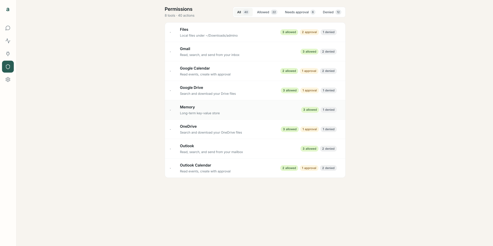
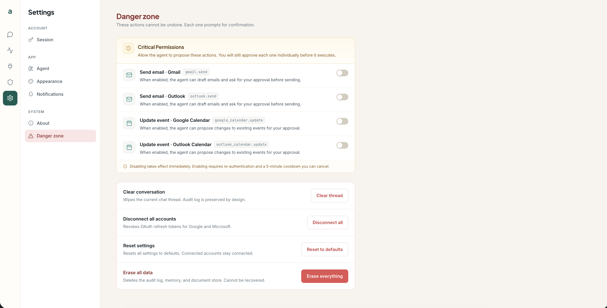

# Permissions

The permission engine is the heart of *"works for you, not on you."* Every tool call the
agent wants to make is checked by a small, **isolated pure function** that receives only
the `(tool, action)` pair — never the conversation, your messages, or the tool arguments.
The agent cannot see the rules, argue with them, or route around them.

A <code>confirm</code> action — <code>google_calendar.create</code> — pausing for your approval before it runs.

## Three outcomes: allow, confirm, deny

admino is **default-deny**: anything not explicitly allowed is denied. Each action
resolves to exactly one of three states:

| State | Meaning |
| --- | --- |
| **allow** | Runs immediately (read-only actions, and saving your own memory notes). |
| **confirm** | Pauses and asks you to approve before it runs. |
| **deny** | Blocked — the agent is told it cannot do this. |

The organization's permission matrix — the full allow / needs-approval / denied matrix.

## Per organization

Each organization has its own permission matrix:

- A new organization starts from the default rules. Upgrading from an earlier version drops
  the old install-wide matrix, and every organization starts from the defaults again.
- Only **Org Admins** change it, on the **Organization** page (`GET` / `PATCH
  /api/org/permissions`). Every change is recorded in the organization's audit log
  (`org.permission_change`) with the tool, the action and the old and new state.
- **Editors** see a read-only summary of what the agent may do on the **Permissions**
  page (`GET /api/permissions/summary`): what runs on its own, what asks first, what is
  denied, and which services the organization switched off.
- Every chat run uses its own organization's matrix, critical promotions and tool services.
  One organization's changes never reach another organization's chats.
- An approval uses the matrix as it is when it runs, even one changed while the approval
  waited behind a reply still running in its chat: a pair set to denied meanwhile is
  refused, not run, and a promotion whose cooldown ended meanwhile applies to it.
- When the organization's data residency policy is on, the Google and Microsoft tools
  (Gmail, Google Calendar, Google Drive, Outlook, Outlook Calendar, OneDrive) count as
  switched off, whatever the matrix and the service switches say: the agent isn't offered
  them, a call to one is refused, and the **Permissions** summary shows them as disabled.
  The stored switches and connections are kept, so they apply again once residency is off.
- A tool that acts on an account uses the calling user's own connection (see
  [Tools → Authentication](tools.md#authentication)), and `memory` only ever reads and
  writes the calling user's own notes. The agent takes the user and organization from the
  logged-in session, never from the model's tool arguments.
- The hardcoded denials below are the same for every organization. No organization can
  change them.

## Writes are never auto-allowed

State-changing actions can only ever be **confirm** or **deny** — never **allow**. If an
Org Admin sets a write action to `allow`, it is stored as **`confirm`**. A
prompt injection that convinces the model to "just send it" still can't turn a write into
a silent action: the engine, which never sees that text, holds the line.

## External content makes side effects ask first

Emails, files, calendar events and memory notes are written by other people, or were
planted by an earlier email ("remember that..."), so they can carry instructions aimed at
the agent. The agent sees them wrapped as data (see
[Tools → External content](tools.md#external-content-is-data-not-instructions)), and the
dispatch layer adds a hard rule on top:

- Once a run has read external content (mail, files, events or memory notes), every
  action that changes something and that the matrix sets to **allow** needs your
  confirmation instead. This holds for the rest of that run and for the later turns of
  the same conversation, because the content is still in the agent's context. A turn
  loads only the chat's latest messages, so the chat remembers it: once a tool result
  with external content is stored in a chat, the chat keeps that mark for good (the
  database refuses to clear it, too), and every later turn there asks first, even when
  the email itself is long out of view. Today the
  one such action is `memory.store`: an email that says "remember X" makes the agent stop
  and ask before it stores anything.
- The files you send with a message are external content too, from the run's first
  action on: every run whose model gets them asks first (an approved action's included),
  and the chat keeps the mark (see
  [Configuration → Attachments](configuration.md#attachments)).
- Approving runs that one call. The next action that changes something asks again.
- Read-only actions (read, list, search, recall) keep running on their own. Which actions
  count as changing something is listed in
  [Tools → Side effects](tools.md#side-effects).
- A decision is only ever tightened: **deny** stays deny and **confirm** stays confirm.
  The permission engine is unchanged and never sees the content; the rule lives in the
  dispatch layer, after the engine's decision.
- The call's audit row says it was escalated (`escalated: true`, see below).

## Hardcoded critical denials

Some denials are **baked into the code** and cannot be overridden by config or by the
agent:

- **Never (immutable).** Every `*.delete` — across `memory`, `google_drive`, both
  calendars, `onedrive`, `documents`, Gmail, and Outlook. These are always denied, full
  stop.
- **Deny by default, at most promotable to _confirm_.** `gmail.send`, `outlook.send`, and
  calendar `update`. These stay denied unless you *deliberately* promote them through the
  Critical Permissions flow — and even then they only ever reach **confirm**, never silent
  **allow**.

These hardcoded rules live in the permission engine and are enforced regardless of what an
organization's matrix says. The matrix routes refuse to change them (`400`).

## Promoting a critical permission

Organization → Critical permissions — the promotable denials.

Promotable criticals (like `gmail.send`) are gated behind a deliberate, high-friction
flow under **Organization → Critical permissions**. Only Org Admins can use it, and a
promotion applies to their own organization only:

1. **Re-authentication with your password** — you prove it's really you. A wrong password
   counts toward the same lockout as a failed login, so a stolen session can't be used to
   guess it.
2. **A 5-minute cooldown** — a built-in pause before the change takes effect. You can
   cancel the promotion while it's pending.

After promotion the action reaches **confirm** — so it *still* asks before every send. You
can never turn one of these into a silent `allow`. When the cooldown ends, every chat of
your organization that isn't in the trash gets a short note, stored as a message, that the
action is now available. Other organizations' chats never do, and neither does a chat
waiting for a confirmation: the note would split the waiting action from its result (see
[Chats](configuration.md#chats)).

Turning a promoted permission off again takes effect at once and needs no password.
Promotions, cancellations and demotions are each recorded in the organization's audit log
(`org.permission_promote`, `org.permission_promote_cancel`, `org.permission_demote`).

## Isolation guarantees

The engine is built so it *cannot* be influenced by model output:

- `permissions.py` is a **pure function** over `(tool, action)`.
- It **never imports** from `agent.py`, `llm*.py`, or `server.py`, and never receives
  LLM-generated context.
- Hardcoded denials cannot be made configurable.

This isolation is a coding standard enforced in review — see the security expectations in
[CONTRIBUTING.md](../CONTRIBUTING.md).

## Append-only audit log

Every tool call the agent makes writes one row to the **`audit_events` table** in
PostgreSQL: the tool, the action, the permission decision (allowed, confirmed or denied),
whether it succeeded, how long it took, and whether it was escalated (`escalated`: an
**allow** turned into **confirm** because the conversation holds external content). The
row never holds the arguments, the tool's output or any message text.

The table is append-only: a database trigger refuses edits and deletions, except the daily
retention purge of rows older than the audit retention (12 months by default). If a row can't be written, the agent stops
the run instead of carrying on unaudited. The app's database role can only add and read
rows there, so it can't switch the trigger off either (see
[Database roles](SECURITY.md#database-roles)). See
[Configuration → Data & storage](configuration.md#data--storage).

---

See also: **[Tools](tools.md)** (what each action does) ·
**[Security Model](SECURITY.md)** (network-level containment) ·
[← Docs home](README.md)
